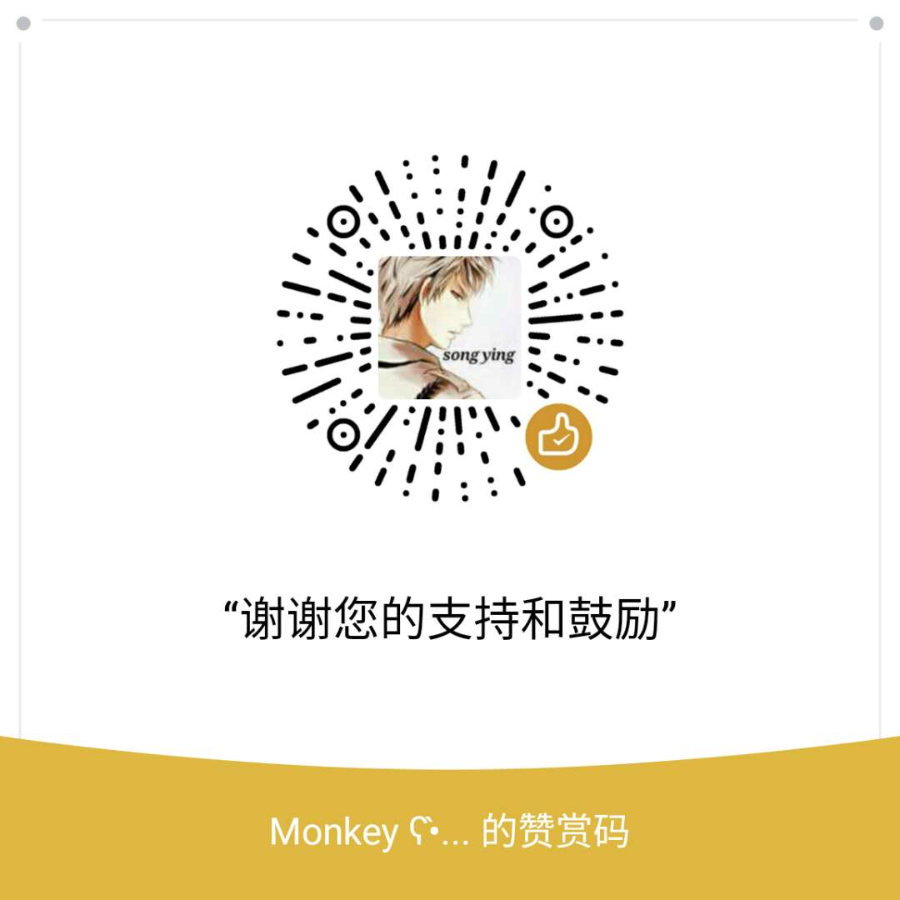

## 谢谢关注磨叽熊猫博客

### 功能简介

本博客框架采用Bootstrap的风格和样式，主体内容使用Markdown语言，并通过[marked.js](https://github.com/chjj/marked)转换成html语言展示出来。

+ 首页显示文章列表，通过读取list.js显示
+ 支持简单搜索，通过匹配文章列表上的文字显示相应列表
+ 通过github编辑功能直接修改markdown文件来修改文章
+ 文章格式内容参照markdown语法

### Blog 结构

```
-- index.html             // 首页
-- thanks.html            // 赞赏页
-- icon.ico               // 图标
-- css                    // css文件
   | -- mycss.css         // 一些样式
-- img                    // 图片文件
   | -- wechatpay.jpeg    // 微信生成的赞赏码
-- js                     // js文件
   | -- main.js           // 
   | -- marked.js         // https://github.com/chjj/marked
   | -- list.js           // 首页列表显示内容
-- file                   // md文件
   | -- template.md       // 详细内容
   | ...
```

### 使用须知

+ 新增文章需要在file文件夹创建新的markdown文件，并在list.js中添加该文章的描述信息

<center><hr><h4>磨叽熊猫感谢有您的支持和关注<h4><h3>👇<h3></center>
